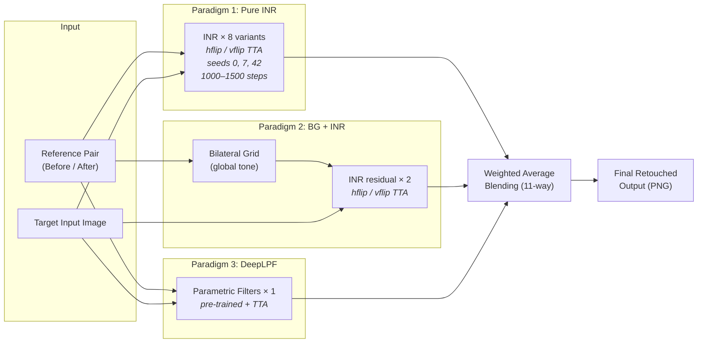

# Heterogeneous Test-Time Optimization Ensemble for Photography Retouching Transfer

**NTIRE 2026 Photography Retouching Transfer Challenge**

We transfer arbitrary photography retouching presets from a single reference pair to unseen input images. Our approach combines three structurally distinct per-sample optimization paradigms into a fixed-weight ensemble, demonstrating robust zero-shot adaptation to previously unseen editing styles.

## Method



Given a reference pair (before, after) and an input image, we independently optimize three types of lightweight models to learn the retouching transformation, then blend their outputs:

| Paradigm | Model | Params | Role |
|----------|-------|--------|------|
| **Implicit Neural Representation** | CNNDWSplitSiren (Kinli et al., 2024) | 11.5K | Per-pixel color mapping via coordinate + signal branches with sine activations |
| **Bilateral Grid + INR** | 3D affine grid + INR residual | ~12K | BG captures global tone mapping; INR corrects the remaining residual |
| **Parametric Filters** | DeepLPF-style tone curves + vignette | ~50K | Pre-trained predictor outputs filter parameters, fine-tuned per sample |

The ensemble contains 11 components spanning different TTA strategies (horizontal/vertical flip), random seeds, optimization budgets, and architecture depths. A fixed weighted average in BGR space produces the final output.

## Pre-trained Checkpoints

Our core Test-Time Optimization (TTO) models require **zero pre-trained checkpoints**. Each INR and Bilateral Grid is initialized from scratch and optimized directly on the test reference pair.

Only the auxiliary DeepLPF component (10% ensemble weight) requires a pre-trained checkpoint: `checkpoints/deeplpf.pt`.

## Repository Structure

```
.
├── models/
│   ├── inr.py                  # CNNDWSplitSiren architecture
│   ├── bilateral_grid.py       # 3D bilateral grid with affine transforms
│   └── deeplpf.py              # Parametric photographic filters
├── optimize_inr.py             # Per-sample INR optimization loop
├── infer_inr.py                # INR inference with TTA variants
├── infer_bg_inr.py             # Two-stage BG + INR inference
├── infer_deeplpf.py            # DeepLPF inference with test-time adaptation
├── blend_ensemble.py           # Weighted ensemble blending
├── make_submission_zip.py      # Submission packaging
├── checkpoints/deeplpf.pt      # DeepLPF weights (only pre-trained component)
├── docker/Dockerfile
├── docker-compose.yml
├── requirements.txt
└── run_inference.sh            # End-to-end pipeline script
```

## Environment Setup

### Docker (recommended)

```bash
docker compose build
docker compose up -d
docker exec -it retouching bash
```

### Manual

```bash
pip install torch torchvision --index-url https://download.pytorch.org/whl/cu128
pip install -r requirements.txt
```

Requires Python 3.10+, CUDA 12.x, and at least one NVIDIA GPU with 16+ GB VRAM.

## Running Inference

### Full pipeline

```bash
# Two GPUs (~2.5 hours for 200 samples)
bash run_inference.sh dataset/Automatic_Evaluation_Data submissions/Automatic.zip --gpus 0,1

# Single GPU (~5 hours)
bash run_inference.sh dataset/Automatic_Evaluation_Data submissions/Automatic.zip --gpus 0
```

### Individual components

```bash
# Pure INR (e.g., SIREN-initialized, vflip TTA)
python infer_inr.py --root . \
    --variant inr_siren_vflip \
    --input_root dataset/Automatic_Evaluation_Data \
    --out_dir outputs/inr_siren_vflip \
    --device cuda --resume

# Two-stage BG + INR
python infer_bg_inr.py --root . \
    --variant bg_inr_hflip \
    --input_root dataset/Automatic_Evaluation_Data \
    --out_dir outputs/bg_inr_hflip \
    --device cuda

# DeepLPF with test-time adaptation
python infer_deeplpf.py --root . \
    --ckpt checkpoints/deeplpf.pt \
    --input_root dataset/Automatic_Evaluation_Data \
    --out_dir outputs/deeplpf \
    --device cuda --tta
```

### Blending

```bash
python blend_ensemble.py \
    --components_dir outputs/_components \
    --out_dir outputs/_blended \
    --zip_path submissions/submission.zip
```

**Note on Reproducibility:** Exact metric results (PSNR/SSIM) may vary slightly (typically within ±0.01 dB) depending on the specific GPU architecture (e.g., Ada Lovelace vs. Hopper) and CUDA non-determinism during test-time optimization.

## Ensemble Components

| Component | Architecture | TTA | Steps | Seed | Weight |
|-----------|-------------|-----|-------|------|--------|
| inr_deep_hflip | m=2, 64n | hflip | 1000 | 42 | 5 |
| inr_strong_hflip | m=2, 64n | hflip | 1500 | 42 | 10 |
| inr_deep_vflip | m=2, 64n | vflip | 1000 | 42 | 5 |
| inr_strong_vflip | m=2, 64n | vflip | 1500 | 42 | 8 |
| inr_siren_vflip | m=1, siren | vflip | 1000 | 42 | 15 |
| inr_siren_hflip_strong | m=1, siren | hflip | 1500 | 42 | 5 |
| inr_deep_vflip_s0 | m=2, 64n | vflip | 1000 | 0 | 5 |
| inr_deep_vflip_s7 | m=2, 64n | vflip | 1000 | 7 | 15 |
| deeplpf | DeepLPF | TTA | -- | -- | 10 |
| bg_inr_hflip | BG + m=2 INR | hflip | 1000 | 42 | 7 |
| bg_inr_vflip | BG + m=2 INR | vflip | 1000 | 42 | 5 |

Total weight: 90 (normalized to 1.0 during blending).

## Data Format

```
dataset/<evaluation_set>/
├── sample1/
│   ├── sample1_before.jpg
│   ├── sample1_after.jpg
│   └── sample1_input.jpg
├── sample2/
│   └── ...
```

Output: `sampleN_output.png` files, packaged flat in a ZIP archive.

## Citation

```bibtex
@inproceedings{kinli2024inretouch,
  title={INRetouch: Context Aware Implicit Neural Representation for Photography Retouching},
  author={K{\i}nl{\i}, Fahri and Ozcan, Bar{\i}s and Kirac, Furkan},
  booktitle={arXiv preprint arXiv:2412.03848},
  year={2024}
}
```

## License

Released for academic and research purposes under the terms of the NTIRE 2026 challenge.
